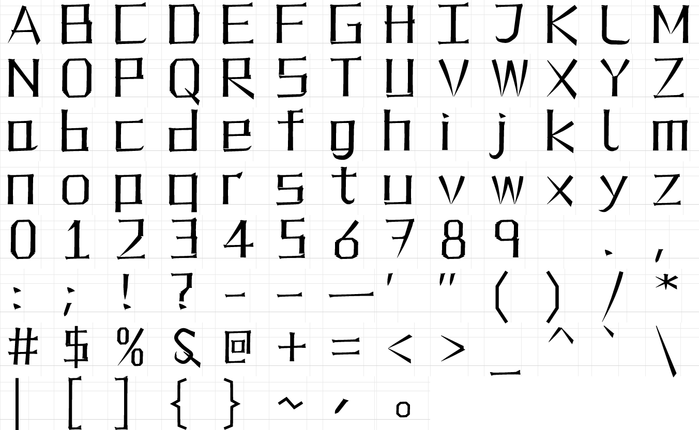

# Mangafont

A Latin alphabet drawn with the stroke vocabulary of Japanese writing.

Every letter is built the way a kanji is built — from a small, fixed set of
brush strokes laid into a notional square — rather than from continuous
curves. The result reads as ordinary A–Z but carries the rhythm, the
terminals and the counters of hiragana, katakana and kanji.



## Why katakana

Japanese has three scripts and uses them for different jobs. **Katakana is
the one for foreign words** — ラーメン, コーヒー, エンリコ・ブルーニ. So a
Latin alphabet meant to read as Japanese should be drawn as *katakana*, not
as kanji: katakana is what a Japanese reader's eye already associates with
foreign text.

That changes the drawing, not just the flavour:

| Katakana | Kanji |
|---|---|
| 1–4 strokes, sparse and open | often 10–20, dense |
| **ロ is the only closed one** | counters everywhere |
| long 払い sweeps carry the character | short strokes in a packed grid |
| the **フ** turn-and-sweep is everywhere | rare |
| detached ticks — ソ シ ツ ミ | strokes meet |

## The hiragana layer

Katakana gives the structure; hiragana gives the hand. The two scripts
differ in a specific way — katakana are angular fragments of 楷書 radicals,
hiragana are cursive, from 草書 — so the softening is three named knobs in
`pen.py`, not a vague blurring:

| Knob | What it does | Hiragana it comes from |
|---|---|---|
| `BOW` | bends every long 払い; nothing is dead straight | の く へ |
| `CURVE` | rounds the corners *inside* a stroke | し つ り |
| `CURL` | lets a はね turn back on itself instead of firing off | し り |

`CURVE` only reaches corners **within** one stroke. The structural 肩 of a
折れ is built from two separate strokes, so it stays as sharp as katakana
wants it — the softening cannot touch the skeleton.

One letter carries a real **結び**, the loop where a hiragana stroke crosses
itself (あ ま ほ ね ぬ): the ampersand, which is the one Latin character that
already wanted one.

**The kana keep their own values.** Softened with the Latin's settings, レ
simply becomes し and ソ becomes ん — so `katakana.py` overrides all three
knobs down to near zero. A real 払い does bow slightly, so that much stays.

## The design system

Four things carry the resemblance. Gesture alone does not: a brushy sans is
still a sans. What makes a Latin alphabet read as kana is structural.

**0. Sweeps.** Katakana have so few strokes that each one has to carry the
character, so it runs the full width of the square and tapers to a needle.
Every diagonal here is a 払い at that length — A K M N R V W X Y Z and their
lowercase — and the **フ** turn (a hairline meeting a hard 肩 corner, then
sweeping away) builds 7, 2, Z, z and J.

**1. Contrast.** In Mincho a 横画 is a *hairline* and a 縦画 is a *slab* —
46 units against 104, a ratio of 0.44. This is the single loudest signal in
the whole script, and getting it wrong is what makes a Japanese-styled Latin
look merely brushy.

**2. Corners, not curves.** Kanji have almost no smooth curves. So there are
none here: every arch in `n m h r` is a 冂 fold, every bowl in `b d p q o` is
a 口, and each fold turns through a **肩** — the small peaked shoulder that
sits at the outer corner of 口 and 日, rather than a mitre.

Because the two halves of a 折れ are different weights, a fold is built from
two strokes that meet at the corner. That weight change across the corner is
the entire point of the shape.

**3. Fit.** The glyphs fill the square. Cap height is 790 of a 1000 em and
the x-height is 600 — **0.76 of the cap**, far higher than any Latin face —
so lowercase sits in a square the way kana do. Side bearings are tight and
near-uniform, which makes a line of text *block up* rather than flow.

**4. Overshoot.** In 十 土 王 廾 a horizontal crosses a vertical and runs
past it. So the crossbars of `A H t f e` and `+` overshoot their stems
instead of stopping politely at them.

### The stroke vocabulary

Every letter is spelled out of the same strokes Japanese uses:

| Stroke | Name | Behaviour |
|---|---|---|
| 横画 | `yoko` | the hairline horizontal; heavy angled press at the entry, thin waist, swelling into the stop |
| 縦画 | `tate` | the slab vertical, plumb and near-even |
| 懸針 | `tate_tail` | a vertical running off to a needle point |
| 折れ | `fold` | a horizontal turning down into a stem, through a 肩 |
| 左払い | `harai_l` | sweep down-left, pressing early, gone to a point |
| 右払い | `harai_r` | sweep down-right, entering thin, pressing into a stop |
| はね | `hane` | the flick — tapered late and abruptly, so it reads as a spike, not a fade |
| 点 | `ten` | the tick: a teardrop that swells as the brush lands |

### The three terminals

Mincho terminals are separate wedges of ink, not fattened stroke ends, so
each is its own contour:

- **うろこ** — the "scale": the fin left at the stop of a 横画. Sized in
  *absolute* units, because scaling it off the stroke's own width makes it
  vanish on exactly the hairlines that need it most.
- **肩** — the shoulder at a fold.
- **起筆** — the flared head where a 縦画 begins.

Horizontals also climb about 1.7° to the right, as a hand naturally draws
them, while verticals stay plumb.

## Letters that lean hardest on the source

Some Latin letters have an exact kanji or kana counterpart, and those are
drawn as the kanji, not as the Latin letter:

- **X**, **x** → メ. **7** → フ. **2**, **Z**, **z** → ス.
- **t** → ナ. **u** → リ. **l** → レ. **I** → エ. **o** → ロ.
- **C**, **c** → 匚, finishing with the はね flick of ヒ.
- **I** → 工 : slab top and bottom, because the square wants filling.
- **L** → 乚 : one stroke that turns and flicks up.
- **T** → 丁 : horizontal, then a vertical down the centre.
- **X**, **x** → 乂 : 左払い crossed by 右払い.
- **Y** → 丫 : two sweeps into a stem.
- **U**, **u** → 凵 / リ : the left stroke turns along the floor.
- **H** → 廾 : the bar crosses both stems and runs past them.
- **n**, **h** → 冂 : a fold hung on a stem.
- **m** → 川 under one bar: three evenly spaced stems.
- **o**, **b**, **d**, **p**, **q** → 口.
- **S**, **s**, **$** → 己 : the fold chain, squared off.
- **t** → 十 : crossbar and a stem that hooks at the foot.
- **f** → 千. **Z**, **z** → 乙. **y** → メ with a tail. **r** → ケ.
- **@** → 回, left open at the foot.
- **#** → 井 : it already was this glyph.
- **+**, **=** → 十, 二.
- **[ ]** → 「 」: the corner bracket shares the skeleton exactly.

`l` is deliberately レ — a flick at the foot — so it can never be confused
with `I` (工). `O` and `o` have their corners cut while `D` is square on the
left and cut only on the right, which is what keeps the three apart.

## Metrics

| | |
|---|---|
| Units per em | 1000 |
| Cap height | 790 |
| x-height | 600 — 0.76 of the cap, so lowercase sits in a square |
| Ascender / descender | 858 / −170 |
| Stem / horizontal weight | 104 / 46 in the reference cut — contrast 0.44 |
| Sweep / corner weight | 84 / 70 |

Metrics are identical across all four cuts, so they can be swapped without
reflowing.

## Coverage

188 glyphs per cut.

- **Latin** — A–Z, a–z, 0–9 and the whole printable ASCII range.
- **Katakana** — the complete U+30A1–U+30F4 block: all 46 base kana, the
  voiced (ガ ザ ダ バ ヴ) and semi-voiced (パ ピ プ ペ ポ) forms, the small
  kana (ァ ィ ゥ ェ ォ ッ ャ ュ ョ), plus ー (chōonpu) and ・ (nakaguro).
  Foreign words need all of these: ブルーニ needs ブ, ティ and ヴィ need the
  small kana.
- Also 、 and 。, en/em dash.

The voiced and small kana are *derived* from the base drawings rather than
redrawn, so they follow the weight axis and inherit any later correction to
a base form. Small kana keep nearly full stroke weight while shrinking
geometrically — scaling weight proportionally would make them read as a
lighter font sitting inside the line.

## Mangafont Comic

A fifth cut, for comic lettering — which is a different job from reading.
It has to hit hard, survive a speech balloon at print size, and read as
Japanese at a glance rather than on inspection.

Its **caps and lowercase come from different registers on purpose**: caps
from a sumi-brush cut (high contrast, dramatic tapers, large flags),
lowercase from a kanji-slab cut (near-monoline, heavy, open counters). The
two sit together because their stems were already close, 216 against 202.

Caps and lowercase carrying different weights inside one face is ordinary
type practice — caps are usually drawn a shade lighter so the two colours
match. This is the same idea with a wider split. `Weight.lower` holds the
second spec and `glyph()` draws each letter under the one for its case.

It also leans on **stroke overshoot**: strokes running past their joins
instead of stopping at them, which is a large part of why kanji read as
kanji from across a room.

## The four text and display cuts

Two families, each with a Regular and a Bold, so ⌘B works inside either:

| Family | Style | Weight | Contrast | For |
|---|---|---|---|---|
| **Mangafont Text** | Regular | 400 | 0.60 | body copy, UI, anything small |
| **Mangafont Text** | Bold | 700 | 0.64 | emphasis in running text |
| **Mangafont** | Regular | 400 | 0.44 | headlines, signage, packaging |
| **Mangafont** | Bold | 700 | 0.51 | display at weight |

**Text is an optical size, not a lighter weight.** It is drawn for small
sizes: lower contrast so the hairlines survive, sturdier terminals, quieter
pressure modulation and a little more sidebearing. Set a headline in
Mangafont and the body in Mangafont Text.

Two things deliberately do *not* scale linearly across the axis, because
they do not in Mincho either:

- **Contrast falls as weight rises.** Holding 0.44 into a bold would leave
  hairlines that snap at any real size, so the bolds sit at 0.51 and 0.64.
- **Terminals grow sub-proportionally**, on a 0.72 power law. An うろこ
  scaled linearly into a bold swallows the letter it sits on.

## Download

Every cut ships as TTF (install on Windows/macOS/Linux), OTF (design apps —
Illustrator, InDesign, Affinity) and WOFF2 (the web). Same outlines in each;
the OTF is the CFF/PostScript build with cubic curves.

| | TTF | OTF | WOFF2 |
|---|---|---|---|
| Mangafont Text Regular | [ttf](build/MangafontText-Regular.ttf) | [otf](build/MangafontText-Regular.otf) | [woff2](build/MangafontText-Regular.woff2) |
| Mangafont Text Bold | [ttf](build/MangafontText-Bold.ttf) | [otf](build/MangafontText-Bold.otf) | [woff2](build/MangafontText-Bold.woff2) |
| Mangafont Regular | [ttf](build/Mangafont-Regular.ttf) | [otf](build/Mangafont-Regular.otf) | [woff2](build/Mangafont-Regular.woff2) |
| Mangafont Bold | [ttf](build/Mangafont-Bold.ttf) | [otf](build/Mangafont-Bold.otf) | [woff2](build/Mangafont-Bold.woff2) |
| Mangafont Comic | [ttf](build/MangafontComic-Regular.ttf) | [otf](build/MangafontComic-Regular.otf) | [woff2](build/MangafontComic-Regular.woff2) |

**[MangafontComic-Specimen.pdf](build/MangafontComic-Specimen.pdf)** — a
four-page specimen for the comic cut, including a mocked-up comic page with
balloons, captions and sound effects all set in the face.

**[Mangafont-Specimen.pdf](build/Mangafont-Specimen.pdf)** — a six-page
specimen document, set throughout in the font, with all four cuts, the full
character set and Latin/katakana samples. The fonts are embedded, so it
renders correctly without installing anything.

Or take the lot in one go: **[`build/Mangafont.zip`](build/Mangafont.zip)** —
all four cuts in all three formats, plus install notes and the licence.

On GitHub, open a file and use the **Download raw file** button.

### Installing

Install the four **TTF**s; they group into the two families above, with bold
linking, so ⌘B works. The OTFs are the same outlines in CFF form — take one
set or the other, not both.

- **macOS** — select all four, double-click, then *Install Font*.
- **Windows** — select all four, right-click, *Install for all users*.
- **Linux** — copy to `~/.local/share/fonts/`, then `fc-cache -f -v`.

Restart any app that was already open; most only scan fonts at launch.

## Building

```sh
make            # builds all four cuts as .ttf, .otf and .woff2
make proof      # regenerates the PNG proof sheet
make specimen   # opens specimen/index.html
```

Requires `fonttools`, `brotli` (for woff2) and `skia-pathops` (to boolean the
overlapping stroke contours into single outlines):

```sh
pip install fonttools brotli skia-pathops
```

## How the code is laid out

```
src/mangafont/weights.py  the weight axis: four cuts, one drawing
src/mangafont/stroke.py   the brush engine: centreline + profile -> contour
src/mangafont/pen.py      the shared stroke vocabulary and metrics
src/mangafont/katakana.py the kana -- and the reference the Latin is drawn against
src/mangafont/glyphs.py   the Latin, as lists of strokes
src/mangafont/build.py    compiles every cut to TTF, OTF and WOFF2
tools/preview.py          pure-stdlib rasteriser, for the proof sheets
tools/render_ttf.py       renders from the compiled .ttf, as an independent check
tools/compare.py          stacks one string across cuts, for judging the axis
```

Glyph sources quote widths in design units at weight 1.0; `stroke.WEIGHT`
scales the whole family at once, so a Light or Bold is a one-line change
followed by a round of spacing work.

## Licence

SIL Open Font License 1.1. See [OFL.txt](OFL.txt).
